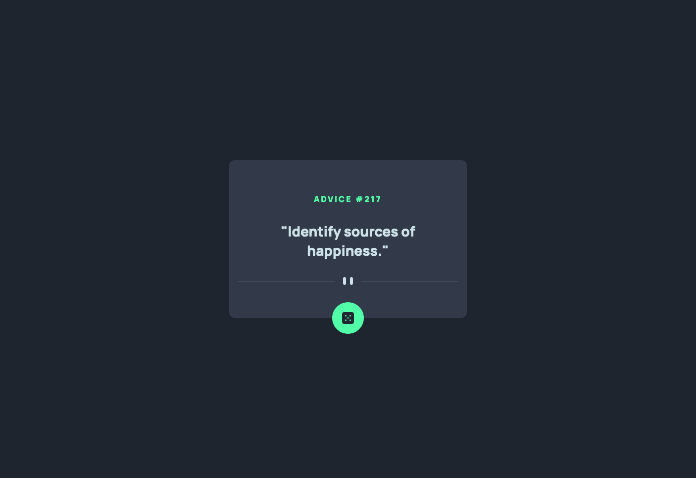

# Frontend Mentor - Advice generator app solution

This is a solution to the [Advice generator app challenge on Frontend Mentor](https://www.frontendmentor.io/challenges/advice-generator-app-QdUG-13db). Frontend Mentor challenges help you improve your coding skills by building realistic projects.

## Table of contents

- [Overview](#overview)
  - [The challenge](#the-challenge)
  - [Screenshot](#screenshot)
  - [Links](#links)
- [My process](#my-process)
  - [Built with](#built-with)
  - [What I learned](#what-i-learned)
  - [Useful resources](#useful-resources)
- [Author](#author)

## Overview
The challenge was to build out this advice generator app using the [Advice Slip API](https://api.adviceslip.com) and get it looking as close to the design as possible.

### The challenge

Users should be able to:

- View the optimal layout for the app depending on their device's screen size
- See hover states for all interactive elements on the page
- Generate a new piece of advice by clicking the dice icon

### Screenshot



### Links

- Live Site URL: [Random Advice Generator](https://radanovicnikola93.github.io/advice-generator-app/)

## My process

- Writing semantic HTML5
- Styled the page with CSS3 with custom properties
- When the page was looking ok on mobile and desktop version I fetched the data to change the content on the page

### Built with

- Semantic HTML5 markup
- CSS custom properties
- Flexbox
- Javascript (fetch API)

### What I learned

- Getting more understanding in fetch API

```js
fetch(url)
  .then()
  .catch()
```

### Useful resources

- [GET fetch API](https://www.digitalocean.com/community/tutorials/how-to-use-the-javascript-fetch-api-to-get-data) - This helped me for fetch the data. I really liked this pattern and will use it going forward.

## Author

- Website - [Nikola Radanović](https://www.nikola-radanovic.com/)
- Frontend Mentor - [@radanovicnikola93](https://www.frontendmentor.io/profile/radanovicnikola93)

